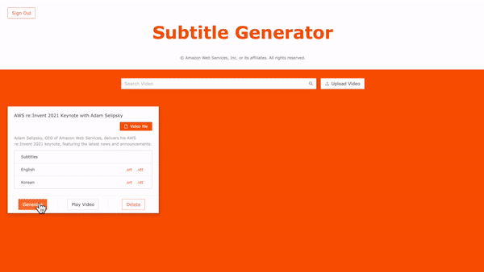
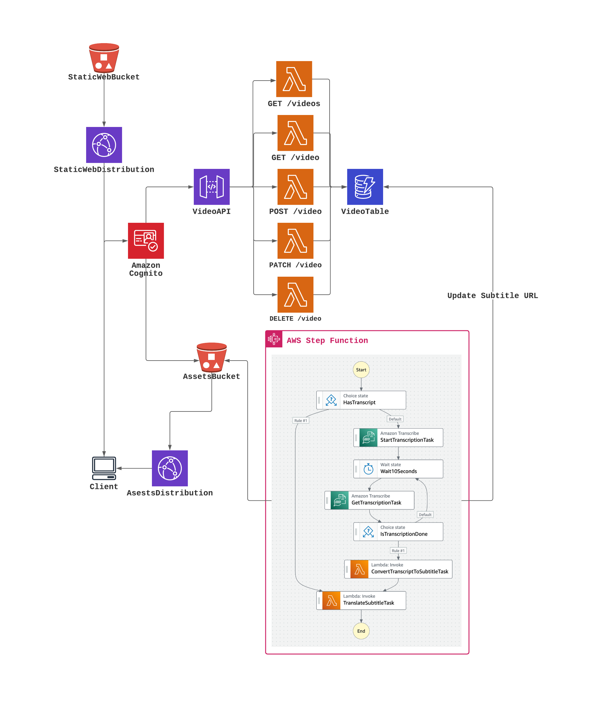
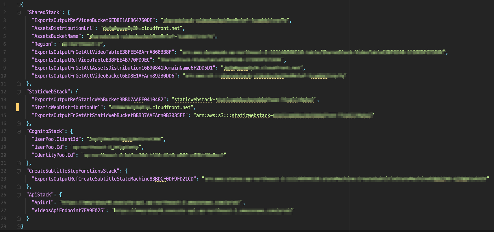
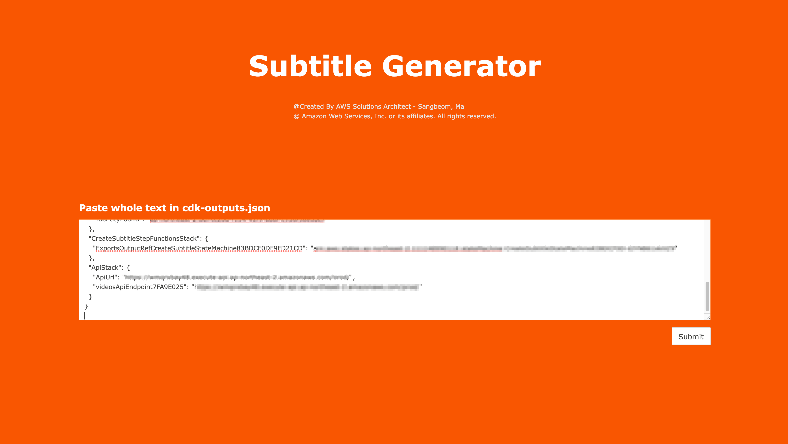

# CDK - Subtitle Generator

With this project, you can provision the infrastructure, backend, and frontend required for a subtitle generator with a single command via CDK.

## Demo


## Architecture


## Prerequisites
1. [AWS Account](https://aws.amazon.com/ko/resources/create-account/)
2. [A user with AdministratorAccess](https://docs.aws.amazon.com/IAM/latest/UserGuide/getting-started_create-admin-group.html) to your account to provision AWS resources for you like S3 Bucket, ApiGateway, Cloudfront, DynamoDB, Cognito, ETC.
3. [Configuration and credential file settings](https://docs.aws.amazon.com/cli/latest/userguide/cli-configure-files.html) - Please refer to the link to set the credentials on your computer.
4. [Install AWS Cloud Development Kit (CDK) v2](https://docs.aws.amazon.com/cdk/v2/guide/getting_started.html#getting_started_install)

## Quick Start
1. ```shell
   $ git clone https://github.com/aws-samples/subtitle-generator-cdk-app
   $ cd subtitle-generator-cdk-app
   $ npm install
   $ npm run build
   $ cdk bootstrap
   $ cdk deploy --all --outputs-file ./cdk-outputs.json
   ```
   <b>Please check for each stack provisioned through the terminal and type `y` to the question.</b>
2. After the entire stack is deployed, check the `cdk-outputs.json` file and access the `StaticWebDistributionUrl` in `StaticWebStack` through your browser.<br>
   (Ex: `"StaticWebDistributionUrl": "xxxxxxxxx.cloudfront.net"`)
3. And copy the entire contents of `cdk-outputs.json` to the clipboard. 
   
4. Paste the copied `cdk-outputs.json` into your browser and click the `Submit` button.
   
5. It's done! Now, sign up with a valid email account and try creating multilingual subtitle files for your videos.

## Useful commands

 * `npm run build`   compile typescript to js
 * `npm run watch`   watch for changes and compile
 * `npm run test`    perform the jest unit tests
 * `cdk deploy`      deploy this stack to your default AWS account/region
 * `cdk diff`        compare deployed stack with current state
 * `cdk synth`       emits the synthesized CloudFormation template
